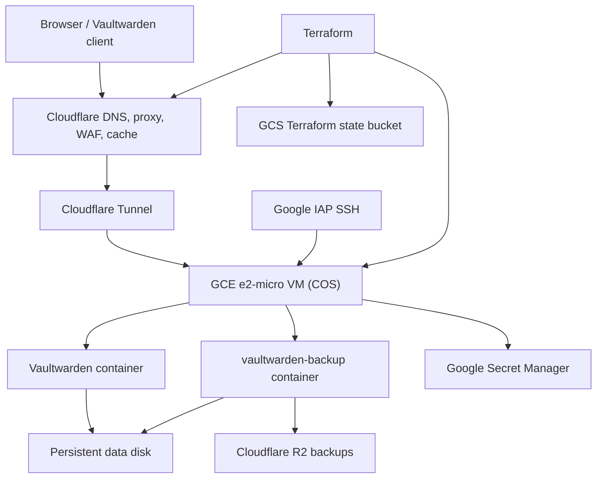

# Vaultwarden on Google Cloud Free Tier with Cloudflare

Deploy a private, security-focused Vaultwarden instance on Google Cloud with Cloudflare Tunnel, Cloudflare DNS, Cloudflare R2 backups, Google Secret Manager, and Terraform-managed infrastructure.

This project is designed for people who want a small personal password manager deployment with a tight network surface: no public Vaultwarden port, SSH through Google IAP, secrets outside the VM image, encrypted offsite backups, and a protected persistent data disk.

> Status: suitable for technical personal use and experimentation. Read the cost, backup, restore, and destroy sections before using it for real secrets.

## Table Of Contents

- [What It Builds](#what-it-builds)
- [Architecture](#architecture)
- [Free Tier And Cost Notes](#free-tier-and-cost-notes)
- [Why You Need A Domain](#why-you-need-a-domain)
- [Prerequisites](#prerequisites)
- [Repository Layout](#repository-layout)
- [Bootstrap And Terraform State](#bootstrap-and-terraform-state)
- [Main Configuration](#main-configuration)
- [First Login And User Creation](#first-login-and-user-creation)
- [Operations](#operations)
- [Secret Rotation](#secret-rotation)
- [State Recovery](#state-recovery)
- [Destroying Resources](#destroying-resources)
- [Security Notes](#security-notes)
- [CI](#ci)

## What It Builds

- A Google Compute Engine `e2-micro` VM running Container-Optimized OS.
- A protected 15 GB persistent disk mounted at `/var/vaultwarden/data`.
- A 15 GB boot disk, keeping total persistent disk size at 30 GB.
- Vaultwarden, Cloudflared, and backup containers pinned by image digest.
- A Cloudflare Tunnel exposing Vaultwarden through a Cloudflare-managed hostname.
- A proxied Cloudflare DNS record for your Vaultwarden subdomain.
- Cloudflare zone settings for HTTPS, TLS minimum version, caching, and login rate limiting.
- A Cloudflare R2 bucket for encrypted Vaultwarden backups.
- Google Secret Manager secrets for R2 credentials, backup password, admin token hash, and tunnel token.
- A dedicated VM service account with scoped secret and restore-script access.
- IAP-only SSH ingress and deny-all fallback ingress rules.
- A GCS bucket for the restore script.
- A hardened GCS bucket for Terraform state through the separate `bootstrap/` module.

## Architecture



The application itself is not exposed directly to the internet. Cloudflared runs on the VM, establishes an outbound tunnel to Cloudflare, and Cloudflare routes your chosen hostname to the internal Vaultwarden container.

SSH is exposed only through Google IAP from `35.235.240.0/20`. General inbound traffic is denied by a targeted firewall rule.

## Free Tier And Cost Notes

This project is free-tier-oriented, not a promise of a zero bill.

The default GCP choices are aligned with the usual Compute Engine Free Tier shape:

- `e2-micro` VM.
- `us-east1` / `us-east1-b` defaults.
- 15 GB boot disk plus 15 GB data disk, 30 GB total standard persistent disk.
- Small GCS bucket usage for Terraform state and restore script.
- Small Secret Manager usage.

Important caveats:

- Google Cloud billing rules can change. Check your billing report.
- External IPv4 behavior should be verified in your account. This project uses an attached ephemeral external IPv4 address for outbound connectivity instead of Cloud NAT, because Cloud NAT is not free-tier friendly.
- Network egress, logs, R2 operations, and R2 storage can become billable if usage grows.
- Cloudflare Free plan capability can vary by account and over time. This repo has used Cloudflare rulesets for rate limiting and cache settings, but you should confirm the plan behavior in your own Cloudflare dashboard.

## Why You Need A Domain

You need to own a domain and manage it in Cloudflare.

Reasons:

- Cloudflare Tunnel routes traffic by hostname, for example `vault.example.com`.
- Terraform creates a proxied Cloudflare DNS record for that hostname.
- Cloudflare TLS, proxying, cache rules, rate limiting, and HTTPS enforcement are zone-level features.
- Vaultwarden clients expect a stable HTTPS origin.

You can use a subdomain such as `vault.example.com`. The root domain does not need to host anything else.

## Prerequisites

Local tools:

- Terraform `~> 1.15.1`.
- Google Cloud SDK, for authentication and IAP SSH.
- A shell environment capable of running Terraform and Bash scripts.
- `argon2` and `openssl` locally to generate the Vaultwarden admin token hash OR you can do it with vaultwarden docker container, see [Secure the ADMIN_TOKEN](https://github.com/dani-garcia/vaultwarden/wiki/Enabling-admin-page#secure-the-admin_token)

Google Cloud:

- A GCP project with billing enabled.
- Permissions to enable APIs, create service accounts, IAM bindings, GCS buckets, Secret Manager secrets, firewall rules, disks, and compute instances.
- A Terraform provisioning service account for `gcp_service_account`. This is separate from the bootstrap `terraform-state` service account and must have enough permissions to create the root resources.
- Permission for your local identity or CI identity to impersonate the Terraform provisioning service account.
- For SSH access through IAP, your user also needs the relevant IAP tunnel and OS Login permissions.
- The bootstrap module must be applied before the main module.

Cloudflare:

- A Cloudflare account.
- A domain hosted in Cloudflare.
- A Cloudflare API token with enough access for DNS records, Cloudflare Tunnel, R2 bucket management, zone settings, and rulesets.
- A Cloudflare R2 S3 access key pair for backups.

Security assumptions:

- This is a single-VM personal deployment, not a high-availability enterprise deployment.
- You keep local `terraform.tfvars`, `backend.config`, and state files private.
- You should test backup restore before storing important secrets.

## Repository Layout

```text
.
|-- bootstrap/                  # Creates the Terraform state bucket and state service account
|-- scripts/
|   |-- instance_startup.sh.tftpl # VM startup template
|   `-- restore_backup.sh         # Manual Vaultwarden restore helper
|-- backend.config.example      # Root backend config template
|-- terraform.tfvars.example    # Root variable template
|-- main.tf                     # Providers and GCS backend declaration
|-- gcp.tf                      # VM, disks, firewall, restore-script bucket
|-- gcp_iam.tf                  # VM service account, IAM, Secret Manager secrets
|-- cloudflare.tf               # DNS, Tunnel, R2, TLS, rate limiting
`-- cloudflare_cache.tf         # Cloudflare cache rule
```

## Bootstrap And Terraform State

Terraform state is sensitive. It can contain resource IDs, infrastructure structure, and generated secrets such as tunnel material. Do not commit state files or upload them to public storage.

This repository uses two Terraform states:

- `bootstrap/terraform.tfstate`: local state for the bootstrap module.
- Root remote state: stored in a GCS bucket created by the bootstrap module.

The bootstrap module exists to avoid a chicken-and-egg problem: Terraform cannot use a remote state bucket until something creates that bucket and grants access to it.

Read [bootstrap/README.md](bootstrap/README.md) before running bootstrap.

### 1. Apply Bootstrap

```bash
cd bootstrap
cp terraform.tfvars.example terraform.tfvars
```

Edit `bootstrap/terraform.tfvars`:

```hcl
gcp_project_id = "my-gcp-project"

tfstate_bucket_name = "my-vaultwarden-tfstate-12345"

terraform_state_impersonators = [
 "user:me@example.com"
]
```

Then run:

```bash
terraform init
terraform plan
terraform apply
```

Save the outputs:

```bash
terraform output
```

You will use:

- `backend_bucket_name`
- `backend_impersonate_service_account`

### 2. Create Root Backend Config

Return to the repository root:

```bash
cd ..
cp backend.config.example backend.config
```

Edit `backend.config`:

```hcl
impersonate_service_account = "terraform-state@my-gcp-project.iam.gserviceaccount.com"
bucket                      = "my-vaultwarden-tfstate-12345"
prefix                      = "vaultwarden/prod"
```

The root `main.tf` intentionally leaves `backend "gcs" {}` empty. Terraform reads the real backend values from your local `backend.config`.

Initialize the root module with:

```bash
terraform init -backend-config=backend.config
```

This creates the root Terraform state object in the GCS bucket under the configured prefix.

## Main Configuration

Create your root variables file:

```bash
cp terraform.tfvars.example terraform.tfvars
```

Example `terraform.tfvars`:

```hcl
# Vaultwarden
vw_admin_token_hash = "$argon2id$v=19$m=65540,t=3,p=4$replace_with_real_hash"
vw_backup_password  = "replace-with-a-long-random-backup-password"
vw_admin_enabled    = true

# GCP
gcp_project_id                 = "my-gcp-project"
gcp_service_account            = "terraform-runner@my-gcp-project.iam.gserviceaccount.com"
gcp_restore_script_bucket_name = "my-vaultwarden-restore-script-12345"
gcp_region                     = "us-east1"
gcp_zone                       = "us-east1-b"

# Cloudflare
cf_domain                = "example.com"
cf_subdomain             = "vault"
cf_api_token             = "replace-with-cloudflare-api-token"
cf_account_id            = "replace-with-cloudflare-account-id"
cf_zone_id               = "replace-with-cloudflare-zone-id"
cf_r2_key_id             = "replace-with-r2-access-key-id"
cf_r2_key                = "replace-with-r2-secret-access-key"
cf_r2_backup_bucket_name = "my-vaultwarden-backups"
cf_r2_location           = "enam"
cf_tunnel_name           = "vaultwarden-gcp-tunnel"
```

`gcp_service_account` is the service account Terraform impersonates to create the main deployment. It is not the same identity as `backend_impersonate_service_account` in `backend.config`. The backend service account only accesses Terraform state.

Minimal example using defaults where possible:

```hcl
vw_admin_token_hash = "$argon2id$v=19$m=65540,t=3,p=4$replace_with_real_hash"
vw_backup_password  = "replace-with-a-long-random-backup-password"
vw_admin_enabled    = true

gcp_project_id                 = "my-gcp-project"
gcp_service_account            = "terraform-runner@my-gcp-project.iam.gserviceaccount.com"
gcp_restore_script_bucket_name = "my-vaultwarden-restore-script-12345"

cf_domain                = "example.com"
cf_subdomain             = "vault"
cf_api_token             = "replace-with-cloudflare-api-token"
cf_account_id            = "replace-with-cloudflare-account-id"
cf_zone_id               = "replace-with-cloudflare-zone-id"
cf_r2_key_id             = "replace-with-r2-access-key-id"
cf_r2_key                = "replace-with-r2-secret-access-key"
cf_r2_backup_bucket_name = "my-vaultwarden-backups"
```

Generate an admin token hash:

```bash
echo -n "choose-a-strong-admin-password" | argon2 "$(openssl rand -hex 32)" -e -id -k 65540 -t 3 -p 4
```

Use the hash as `vw_admin_token_hash`. You will sign in to `/admin` with the original plain password, not the hash.

Deploy:

```bash
terraform init -backend-config=backend.config
terraform plan
terraform apply
```

After apply, wait for the VM startup script to pull images, mount the data disk, create the containers, and download the restore helper.

## First Login And User Creation

Vaultwarden signups are disabled by default in the container. The intended first-user flow is:

1. Set `vw_admin_enabled = true`.
2. Apply Terraform.
3. Visit `https://vault.example.com/admin`.
4. Sign in with the plain admin password used to generate `vw_admin_token_hash`.
5. Create or invite your user from the admin page.
6. Sign in to the normal web vault at `https://vault.example.com`.
7. Verify the user works.
8. Set `vw_admin_enabled = false`.
9. Apply Terraform again.

If you do not configure SMTP, use an email-shaped username that you control or a local placeholder such as `me@vault.invalid`. Some Vaultwarden flows still expect an email-shaped login even if email delivery is not configured.

To temporarily re-enable admin later:

```hcl
vw_admin_enabled = true
```

Apply, perform the admin task, then set it back to `false` and apply again.

Note: the startup script controls `ADMIN_TOKEN` through the container environment. If you manually save admin settings into Vaultwarden's persistent `config.json`, verify that `/admin` is actually disabled after changing `vw_admin_enabled` back to `false`.

## Operations

### SSH Into The VM

Use IAP:

```bash
gcloud compute ssh vaultwarden-server \
 --project=my-gcp-project \
 --zone=us-east1-b \
 --tunnel-through-iap
```

Useful checks on the VM:

```bash
sudo journalctl -u google-startup-scripts.service -b --no-pager
docker ps -a
docker logs vaultwarden
docker logs cloudflared
docker logs vaultwarden_backup
mount | grep vaultwarden
```

### Startup Script Behavior

The VM uses `metadata_startup_script`. Changes to the startup script or values rendered into it can cause Terraform to replace the VM. The protected data disk reduces the blast radius: replacement should be downtime, not data loss.

The startup script:

- Verifies `jq` exists.
- Loads secrets from Google Secret Manager.
- Pulls all container images before stopping existing containers.
- Waits for the persistent disk and fails closed if it cannot mount it.
- Mounts backup configuration on tmpfs.
- Starts Vaultwarden, Cloudflared, and backup containers.
- Downloads `/var/restore_backup.sh`.

### Persistent Data Disk

Vaultwarden data lives on a separate persistent disk mounted at:

```text
/var/vaultwarden/data
```

The disk has Terraform `prevent_destroy = true`. A normal destroy or accidental refactor should fail before deleting primary Vaultwarden data.

### Backups

The backup container writes encrypted backups to Cloudflare R2 using:

- R2 access key ID from Secret Manager.
- R2 secret access key from Secret Manager.
- Backup password from Secret Manager.
- `vw_backup_cron`, default `0 0 * * *`.
- `vw_backup_keep_days`, default `180`.

Changing `vw_backup_password` affects new backups. Old backups still require the old password, so keep old backup passwords until those backups expire or are intentionally deleted.

### Restore Backups

The startup script downloads the restore helper to:

```text
/var/restore_backup.sh
```

`scripts/restore_backup.sh` is a manual restore script. It downloads a selected encrypted backup from R2, stops the containers, creates a local pre-restore snapshot, runs the backup container's restore command, and starts the containers again.

Run it over SSH:

```bash
sudo env CONFIRM=restore R2_BUCKET=my-vaultwarden-backups \
 bash /var/restore_backup.sh backup-20260701-000000.zip
```

The script creates a local safety snapshot:

```text
/var/vaultwarden/pre-restore-<timestamp>.tgz
```

Test restore before relying on the system for important secrets.

### Recover a User After VM Replacement

If the VM is replaced but the data disk remains, the startup script mounts the existing data disk and the user should still exist.

If the data disk is empty, missing, or intentionally replaced, restore from R2:

```bash
sudo env CONFIRM=restore R2_BUCKET=my-vaultwarden-backups \
 bash /var/restore_backup.sh backup-20260701-000000.zip
```

After restore, verify:

```bash
docker logs vaultwarden
```

Then sign in with the restored user account.

## Secret Rotation

Secrets are stored in Google Secret Manager and read by the VM at startup. After rotating a secret, restart the VM or rerun the startup script so containers pick up the new values.

```bash
sudo google_metadata_script_runner startup
```

### Rotate The Admin Token

1. Generate a new admin token hash.
2. Update `vw_admin_token_hash`.
3. Add a new Secret Manager version.
4. Restart or rerun startup.

With the current Terraform resources, `secret_data_wo_version` controls write-only secret updates. For Terraform-driven rotation, update the secret value and increment the relevant `secret_data_wo_version` in `gcp_iam.tf`. Alternatively, add a secret version manually with `gcloud secrets versions add`.

### Rotate R2 Credentials

1. Create a new Cloudflare R2 S3 access key pair.
2. Update `cf_r2_key_id` and `cf_r2_key`.
3. Add new Secret Manager versions.
4. Restart or rerun startup.
5. Confirm a new backup succeeds.
6. Disable or delete the old R2 key.

### Rotate Backup Password

1. Set a new `vw_backup_password`.
2. Add a new Secret Manager version.
3. Restart or rerun startup.
4. Keep the old password until old backups are no longer needed.

### Rotate Cloudflare Tunnel Credentials

The tunnel token is managed through Terraform and stored in Secret Manager. If you suspect compromise, recreate or rotate the Cloudflare Tunnel and apply Terraform, then restart the VM or rerun startup.

## State Recovery

Root Terraform state is remote in GCS. Bootstrap state is local in `bootstrap/terraform.tfstate`.

If root remote state is damaged, recover from GCS object versioning if possible.

If bootstrap local state is lost, use:

```bash
cd bootstrap
bash recover-state.sh user:me@example.com
```

See [bootstrap/README.md](bootstrap/README.md) for details.

## Destroying Resources

This project intentionally makes destructive operations harder:

- The Cloudflare R2 backup bucket has `prevent_destroy = true`.
- The GCP Vaultwarden data disk has `prevent_destroy = true`.
- The bootstrap state bucket has `force_destroy = false`.

As a result, `terraform destroy` may fail until you intentionally remove or change those protections. That is expected.

Before intentionally destroying:

1. Confirm you have a tested backup.
2. Export anything you need from Vaultwarden.
3. Decide whether to retain or delete the data disk.
4. Decide whether to retain or delete the R2 bucket.
5. Keep Terraform state until cleanup is complete.

## Security Notes

- Do not commit `terraform.tfvars`, `backend.config`, `.terraform/`, or any `*.tfstate` files.
- Keep Cloudflare API tokens and R2 keys scoped as tightly as practical.
- Keep the admin page disabled except when needed.
- Test backup restore periodically.
- Watch GCP and Cloudflare billing after deployment.
- Review Cloudflare dashboard changes after apply, especially zone settings and rulesets.
- This is not a multi-region or high-availability design.

## CI

GitHub Actions run:

- ShellCheck.
- Terraform format and validate.
- TFLint.
- Trivy config scanning for high and critical findings.
